# AAE6102-Assignment1
POLYU 2025 S2 AAE6102-Assignment1

# GNSS Signal Acquisition and Processing

## Task 1 — Signal Acquisition

### Objective
Process the IF data using a GNSS SDR and generate the initial acquisition results.

### GNSS Signal Acquisition Process
The GPS signal acquisition process is structured into three distinct phases: initialization, initial acquisition, and precision refinement.

#### Phase 1: Initialization
The initialization phase involves setting up the necessary parameters for signal processing. This includes determining the number of samples for a complete C/A code period, calculating the sampling interval, extracting short segments from the raw signal for initial acquisition, preparing a longer DC-removed signal segment for refinement, generating a pre-computed lookup table of satellite C/A codes, defining the frequency search range (typically in 500Hz increments), and initializing arrays to store results. These preparations establish the foundation for subsequent signal processing.

#### Phase 2: Initial Acquisition (Coarse Search)
The initial acquisition phase aims to obtain preliminary estimates of code phase and carrier frequency for each satellite's PRN code. The process involves performing FFT on each potential PRN code to obtain its frequency domain representation, then testing each frequency bin within the defined range. For each bin, a local carrier signal is generated and removed to obtain in-phase and quadrature components, which are then transformed via FFT and used for spectral domain cross-correlation. Finally, correlation peaks are identified along with corresponding code phases and frequencies. If the peak-to-average ratio exceeds a threshold, the signal is considered potentially acquired.

#### Phase 3: Precision Refinement (Fine Acquisition)
The precision refinement phase refines the frequency estimates obtained during initial acquisition. First, a longer C/A code sequence is generated using the coarse code phase estimate from the previous phase. Code modulation is removed by correlation to isolate the carrier component. Then, a high-resolution FFT (at least 8 times longer than the code sequence) is applied, precise frequency bins are calculated, and the carrier frequency is refined by locating the peak magnitude in the high-resolution spectrum. The coarse code phase from the initial search is retained as the final code phase estimate.

### Methods for Reliability and Robustness
To ensure result reliability, two main methods are employed: first, two adjacent 1-millisecond segments are selected from the received signal for simultaneous processing, with the maximum correlation coefficient taken; second, beyond identifying the maximum correlation peak, the second-largest peak is also searched for, and if the ratio between them exceeds 1.5 and they are not too close, the satellite signal is considered successfully acquired.

### Results
The test results show successful acquisition of satellites 1, 3, 11, and 18 in the urban dataset, while satellites 16, 22, 26, 27, and 31 were acquired in the open sky dataset.

# Task 2 — Tracking Implementation

## Objective
Modify the tracking loop (DLL) to generate correlation plots and analyze tracking performance, examining urban interference effects on correlation peaks. (Multiple correlators must be implemented for plotting the correlation function)

## Tracking Process and Components

### Step 1: Tracking Fundamentals
Utilizing initial frequency and phase information from acquisition, the signal undergoes downconversion to compute multi-branch correlation values (Early, Prompt, Late) for I/Q component extraction. FFT techniques enhance computational efficiency through the following approach:

For phase processing, inverse FFT methodology is applied: IP + jQP = FFT^(-1)(FFT(signal) · conj(PRNprompt))

The DLL discriminator determines code phase error through the calculation:
DLL Discriminator = √(I²E + Q²E - I²L + Q²L) / √(I²E + Q²E + I²L + Q²L)

### Step 2: Real-Time Adjustment Mechanism
DLL/PLL discriminator outputs undergo low-pass filtering (e.g., IIR: y[n] = αx[n] + (1-α)y[n-1]), with local carrier frequency and PRN code phase dynamically adjusted via NCO. The system updates at 1ms intervals (matching GPS C/A code cycles), storing results in the trackResults structure to maintain real-time synchronization with received signals.

### Step 3: Design Considerations
Loop bandwidth and damping ratio optimization balances noise suppression against dynamic response capabilities. The tracking loop outputs carrier frequency, code phase, and navigation bits, while multi-correlator plots facilitate performance analysis, particularly regarding urban environment interference effects on correlation peaks.

## Results Analysis

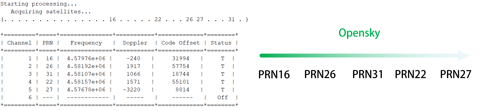
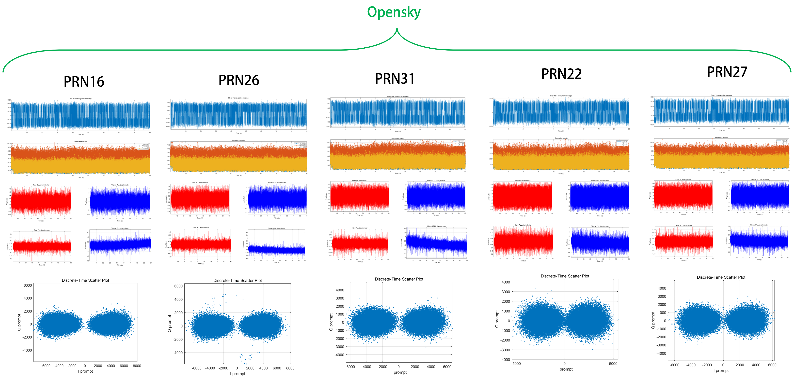

### Open-Sky Performance
* **PRN 16**: Filtered DLL maintains stability in the 6000-8000 range, with raw discriminator and filtered PLL showing fluctuation. Raw DLL amplitude contains noise, but filtered DLL stabilizes at 0.2-0.4, indicating effective noise reduction. Overall tracking remains stable.
  
* **PRN 26**: Filtered DLL correlation values stay steady in the 6000-8000 region, raw discriminator exhibits greater variation. Filtered PLL tracks closely with slight deviations. Raw DLL amplitude fluctuates (±0.5), filtered DLL stabilizes at 0.2-0.3, demonstrating good noise suppression.
  
* **PRN 31**: Filtered DLL correlation baseline appears lower at 4000-6000 compared to satellites 16 and 26. Raw discriminator and filtered PLL oscillate more significantly, raw DLL amplitude varies (±0.6), filtered DLL stabilizes at 0.1-0.3 with downward trends. Tracking appears less stable than previous satellites.
  
* **PRN 22**: Filtered DLL correlation maintains at 5000-7000, raw discriminator shows spikes. Filtered PLL tracks smoothly with some divergence. Raw DLL amplitude fluctuates (±0.5), filtered DLL stabilizes at 0.2-0.4 with dips. Tracking maintains moderate stability, with filtering effectively mitigating noise.
  
* **PRN 27**: Filtered DLL correlation holds at 4000-6000, similar to satellite 31. Raw discriminator and filtered PLL vary notably. Raw DLL amplitude fluctuates (±0.6), filtered DLL stabilizes at 0.1-0.3 with end instability. Tracking exhibits lowest stability, though filtering provides some improvement.

The SoftGNSS system performs well in open-sky environments, with satellites 16 and 26 displaying optimal stability and signal strength. In the open-sky environment, signal strength progressively decreases from PRN 16, PRN 26, PRN 31, PRN 22, to PRN 27, correlating with their tracking stability performance. Filtering mechanisms (PLL and DLL) effectively reduce noise and stabilize outputs. Satellites 31, 22, and 27 demonstrate weaker performance due to signal or environmental factors, but the system maintains lock overall.

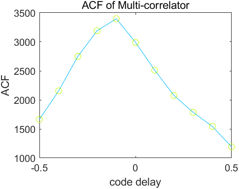

The autocorrelation function exhibits a distinctive triangular formation with its apex positioned precisely at zero code offset. Peak correlation magnitude reaches approximately 3400 units at this central point. Moving away from this maximum value, the correlation intensity diminishes in a balanced manner toward both extremities, reaching approximately 1200 units at the measurement boundaries (±0.5 code delay units). This well-formed symmetrical pattern with its gradual tapering indicates optimal signal alignment and proper tracking functionality. Such characteristic triangle-shaped correlation profiles are fundamental to GNSS processing systems employing standard spreading sequences, demonstrating the theoretical relationship between incoming satellite transmissions and internally generated reference signals. The pronounced peak definition and robust correlation amplitudes suggest excellent reception conditions and successful signal capture procedures.

### Urban Environment Performance

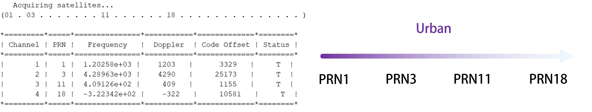
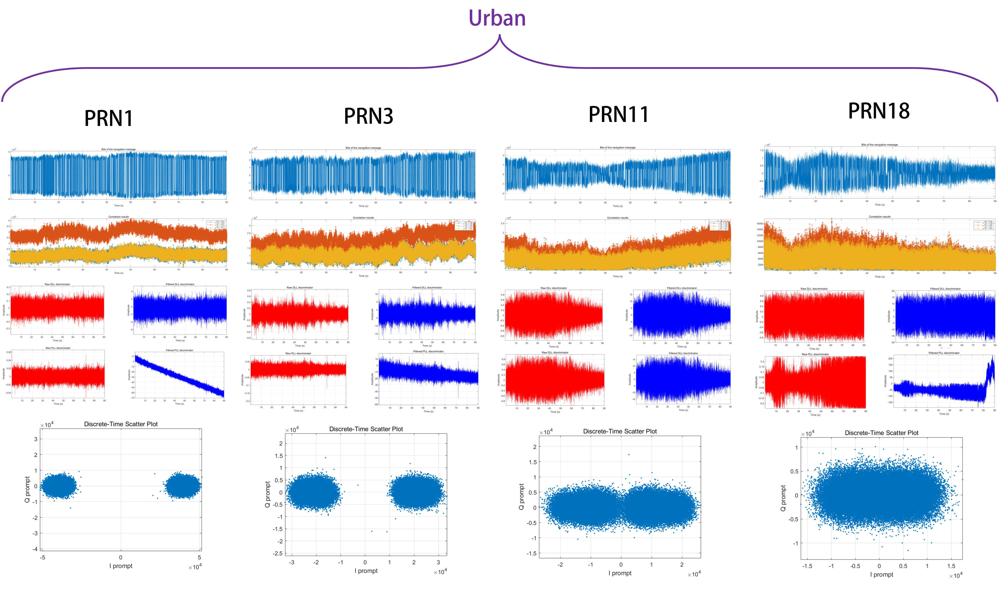

Tracking results for satellites 1, 3, 11, and 18 in the urban dataset illustrate a stable filtered DLL baseline, though correlation strength varies across PRNs. Raw PLL and DLL discriminators exhibit significant noise, while filtering stabilizes outputs to some extent. Inconsistent correlation and occasional signal instability occur, particularly toward tracking conclusion. In the urban environment, signal strength decreases in the order of PRN 3, PRN 18, PRN 1, and PRN 11, reflecting their varying visibility conditions in the urban canyon.

These phenomena result from urban multipath effects and signal obstructions, which weaken satellite signals and introduce noise. Lower correlation baselines (e.g., PRN 1 and 11) reflect signal attenuation from buildings, while higher values (e.g., PRN 3 and 18) indicate better visibility conditions. Intermittent signal loss arises from blockages and reflections during movement.

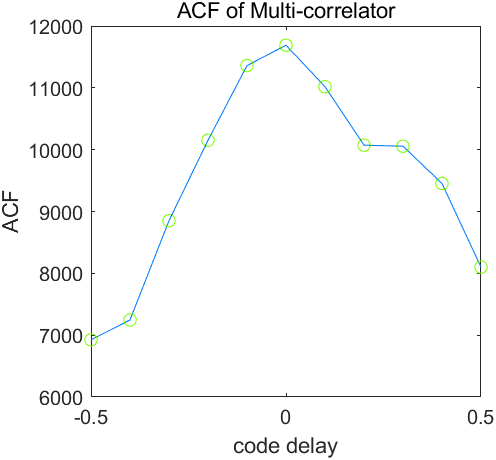

The correlation function measured in urban environments displays remarkably elevated magnitude levels compared to open-sky conditions, with peak values reaching approximately 11700 units—more than three times the 3400-unit maximum observed in unobstructed settings. Beyond this amplitude difference, the structural characteristics exhibit significant disparities. While unobstructed environments produced symmetrical triangular correlation patterns, the urban measurement reveals pronounced asymmetry and structural anomalies. Particularly noteworthy is the irregular formation occurring between 0.2-0.3 code delay units on the right slope, where the correlation curve deviates from its expected trajectory to form a distinctive horizontal segment. This disruption in the expected correlation profile indicates substantial signal propagation complexity in urban settings.

### Open-Sky versus Urban Comparison
Urban tracking underperforms compared to open-sky results, where satellites 16 and 26 maintained stable 6000-8000 correlations with minimal noise. Urban multipath and obstructions cause wider amplitude fluctuations and inconsistent correlations (5000-15000), reducing filtering effectiveness. Open-sky's clear line-of-sight contrasts with urban challenges, explaining the reliability gap. The fundamental difference lies in unobstructed signal propagation paths in open environments versus urban multipath and blockages disrupting signal integrity.

# Task 3 – Navigation Message Extraction

## Objective
Extract and interpret the navigation message to obtain critical satellite parameters including ephemeris information for at least one satellite.

## Methodology and Implementation

### Phase 1: Navigation Signal Sampling
**Implementation Approach:** The system extracts 1500 bit samples spanning 5 complete subframes (300 bits each, with 20 samples representing 1 bit) from the trackResults.I_P data stream. The subframeStart parameter identifies the beginning point of each subframe, with an additional 20-sample buffer included for alignment purposes. This 30-second data collection window (5 subframes) ensures comprehensive capture of all necessary navigation components.

### Phase 2: Sample Processing for Bit Detection

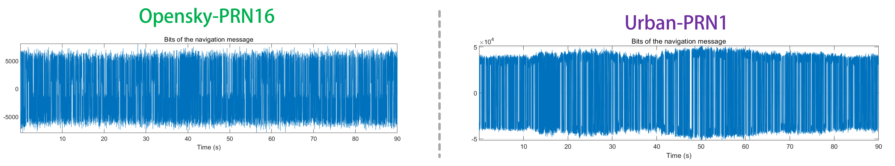

**Technical Method:** The collected samples undergo restructuring into a 20×N matrix formation, where each 20-sample row corresponds to a single bit. Column summation is then performed to consolidate these samples, leveraging signal averaging principles to enhance reliability through noise reduction. This aggregation technique transforms multiple data points (20 per bit) into consolidated bit values, substantially improving the decoding process reliability in varying signal conditions.

**Environmental Impact Analysis:** Comparative assessment of open-sky versus urban navigation message decoding reveals distinct performance characteristics. Open-sky environments demonstrate consistent bit amplitude (~±5000) with minimal fluctuations, reflecting favorable signal-to-noise ratio, limited interference, and stable tracking performance (Filtered PLL/DLL variations of approximately ±50/±5). In contrast, urban settings exhibit pronounced amplitude instability (up to ±5×10⁴) with significant signal dropouts at various timestamps (30s, 50s, 70s intervals), resulting from multipath interference, signal obstructions, reduced SNR, and tracking instabilities (PRN 18 shows Filtered PLL/DLL variations of ±150/±6). These environmental variances significantly impact decoding integrity and reliability.

### Phase 3: Bit Value Determination
**Processing Logic:** A threshold-based decision mechanism converts the aggregated samples into binary format, applying a straightforward comparison rule (values > 0 become 1, values ≤ 0 become 0). This transformation stage is critical for converting the analog-like summed values into the digital binary structure that matches the navigation message format requirements.

### Phase 4: Data Formatting
**Format Conversion:** The binary values are converted into a string representation containing exclusively "0" and "1" characters using the dec2bin function, creating a format suitable for subsequent processing by the ephemeris extraction algorithm. This standardization ensures compatibility with the decoding functions while maintaining data integrity.

### Phase 5: Ephemeris and Timing Data Extraction
**Decoding Protocol:** The ephemeris function parses the complete 1500-bit sequence (5 subframes) to extract critical satellite parameters (such as e - eccentricity) and Time of Week (TOW) information from Subframe 1. The function utilizes navBitsBin(2:1501) for parameter extraction while navBitsBin(1) supports data validation processes. This operation produces a structured ephemeris dataset (eph structure) and precise timing information essential for subsequent positioning calculations.

## Process Summary
The navigation data decoding implementation within postNavigation.m follows a systematic workflow: sampling navigation bits, restructuring and aggregating samples, determining binary values through thresholding, converting to appropriate string format, and extracting ephemeris and TOW data via the ephemeris function. Throughout this sequence, data validation checks ensure integrity, ultimately providing reliable inputs for the positioning algorithm.

## Combined Ephemeris Data

### Open-Sky and Urban Environment Comparison

| Ephemeris data | Open-Sky |  |  |  | Urban |  |  |  | Meaning |
|----------------|----------|----------|----------|----------|----------|----------|----------|----------|---------|
| | **PRN-16** | **PRN-22** | **PRN-26** | **PRN-31** | **PRN-1** | **PRN-3** | **PRN-11** | **PRN-18** | |
| **C_ic** | -1.0058e-07 | -1.0058e-07 | -2.0489e-08 | -1.1362e-07 | -7.4506e-08 | 1.1176e-08 | -3.1665e-07 | 2.5332e-07 | Cosine-harmonic-correction-to-inclination (rad) |
| **omega_0** | -1.6743 | 1.2727 | -1.8129 | -2.7873 | -3.1060 | -2.0642 | 2.7258 | 3.1218 | Right ascension at reference time (rad) |
| **C_is** | 1.3597e-07 | -9.3132e-08 | 8.9407e-08 | -5.0291e-08 | 1.6019e-07 | 5.2154e-08 | -1.3225e-07 | 3.5390e-08 | Sine-harmonic-correction-to-inclination (rad) |
| **i_0** | 0.9716 | 0.9365 | 0.9399 | 0.9559 | 0.9761 | 0.9629 | 0.9008 | 0.9546 | Inclination at reference time (rad) |
| **C_rc** | 237.6875 | 266.3438 | 234.1875 | 240.1563 | 287.4688 | 160.3125 | 324.4063 | 280.1563 | Cosine-harmonic-correction-to-orbit-radius (m) |
| **omega** | 0.6796 | -0.8879 | 0.2957 | 0.3116 | 0.7115 | 0.5950 | 1.8915 | 1.3930 | Argument of perigee (rad) |
| **omegaDot** | -8.0128e-09 | -8.6686e-09 | -8.3114e-09 | -7.9950e-09 | -8.1696e-09 | -7.8325e-09 | -9.3043e-09 | -8.6107e-09 | Rate of right ascension (rad/s) |
| **IODE_sf3** | 9 | 22 | 113 | 83 | 72 | 72 | 83 | 56 | Issue of Data, Ephemeris (Subframe 3) |
| **IDot** | -4.8931e-10 | -3.0358e-11 | -4.1752e-10 | -3.2144e-11 | -1.8108e-10 | 4.8109e-10 | -1.2858e-11 | -1.6179e-10 | Rate of inclination (rad/s) |
| **WeekNumber** | 1155 | 1155 | 1155 | 1155 | 1032 | 1032 | 1032 | 1032 | GPS-week number |
| **T_GD** | -1.0245e-08 | -1.7695e-08 | 6.9849e-09 | -1.3039e-08 | 5.5879e-09 | 1.8626e-09 | -1.2573e-08 | 5.5879e-09 | Satellite clock correction (s) |
| **IODC** | 234 | 218 | 15 | 228 | 12 | 4 | 229 | 244 | Issue of Data, Clock |
| **t_oc** | 396000 | 396000 | 396000 | 396000 | 453600 | 453600 | 453600 | 453600 | Clock reference time (s) |
| **a_f1** | -6.3665e-12 | 9.2086e-12 | 3.9790e-12 | -1.9327e-12 | -9.4360e-12 | -1.1369e-12 | 8.5265e-12 | 3.1832e-12 | Clock drift linear term (s/s) |
| **a_f0** | -4.0693e-04 | -4.8947e-04 | 1.4479e-04 | -1.4490e-04 | -1.2087 | 1.8633e-04 | -5.9009e-04 | 9.8655e-05 | Clock bias (s) |
| **IODE_sf2** | 9 | 22 | 113 | 83 | 72 | 72 | 83 | 56 | Issue of Data, Ephemeris (Subframe 2) |
| **C_rs** | 23.3438 | -99.8125 | 21.2500 | 30.7188 | -120.7188 | -62.0938 | -67.1250 | -113.8750 | Sine harmonic correction to orbit radius (m) |
| **delta_n** | 4.2466e-09 | 5.2831e-09 | 5.0513e-09 | 4.8073e-09 | N/A | N/A | N/A | N/A | Mean motion correction (rad/s) |
| **M_0** | 0.7181 | -1.2610 | 1.7356 | 2.8245 | 0.5179 | -0.4304 | -0.1989 | 0.2598 | Mean anomaly at reference time (rad) |
| **C_uc** | 1.3895e-06 | -5.1558e-06 | 1.1530e-06 | 1.4603e-06 | 8.6149e-06 | 3.9066e-06 | 3.6042e-06 | 6.1095e-06 | Cosine-harmonic-correction-to-latitude (rad) |
| **e** | 0.0123 | 0.0067 | 0.0063 | 0.0103 | 0.0089 | 0.0022 | 0.0166 | 0.0154 | Eccentricity |
| **C_us** | 7.6871e-06 | 5.1651e-06 | 7.0408e-06 | 7.2289e-06 | 5.3031e-06 | 3.9066e-06 | 1.5123e-06 | 5.1148e-06 | Sine-harmonic-correction-to-latitude (rad) |
| **sqrt_A** | 5.1538e+03 | 5.1537e+03 | 5.1536e+03 | 5.1536e+03 | 5.1537e+03 | 5.1538e+03 | 5.1537e+03 | 5.1537e+03 | Square-root-of-semi-major-axis (m^(1/2)) |
| **t_oe** | 396000 | 396000 | 396000 | 396000 | 453600 | 453600 | 453600 | 453600 | Ephemeris reference time (s) |

# Task 4 – Position and Velocity Estimation

## Objective
Utilize pseudorange measurements acquired from tracking to implement the Weighted Least Squares (WLS) algorithm for determining user position and velocity. Generate visualizations of position and velocity outcomes, evaluate them against reference truth data, and examine how multipath phenomena impact the WLS computational results.

## Position Estimation Methodology

The Weighted Least Squares approach for determining receiver coordinates and movement rates in GNSS implementations functions by minimizing weighted differences between observed and calculated measurements, accommodating varying observation quality levels. For positional calculations, pseudorange observations are expressed as:

$$\rho_{obs} = \| r_{sat} - r_{rec} \| + c \cdot dt + \epsilon$$

where $r_{sat}$ and $r_{rec}$ represent satellite and receiver positions respectively, $dt$ indicates clock offset, and $\epsilon$ represents measurement noise. The WLS solution progressively refines the state vector $x = [x, y, z, dt]^T$ through the equation:

$$x = (A^T WA)^{-1}A^T Wb$$

In this formula, $A$ denotes the geometry matrix, $W$ represents a diagonal weighting matrix (typically using $W_{ii} = \sin^2(el_i)$), and $b$ contains the measurement residuals.

### Implementation Framework

The algorithm operates through multiple refinement cycles:
1. Initialize weight matrix and positional parameters
2. For each satellite:
   - Calculate geometric range between satellite and estimated position
   - Determine signal propagation time
   - Apply appropriate coordinate transformations
   - Assign weights based on satellite elevation angles
   - Implement tropospheric corrections when enabled
   - Compute observation residuals and geometry matrix elements
3. Update position estimate using the WLS formula
4. Iterate until convergence criteria are satisfied

## Velocity Determination Process

For velocity computation, pseudorange rate measurements $\dot{\rho}$ derived from Doppler observations are utilized:

$$\dot{\rho} = -v_{sat} \cdot u + v_{rec} \cdot u + \epsilon_D$$

where $v_{sat}$ and $v_{rec}$ denote satellite and receiver velocities, and $u$ represents the unit line-of-sight vector. The receiver velocity $v_{rec} = [v_x, v_y, v_z]^T$ is determined using:

$$v_{rec} = (A_v^T W_v A_v)^{-1}A_v^T W_v b_v$$

Here, $A_v$ functions as the velocity design matrix and $W_v$ mirrors the weighting approach used in position estimation. The weighting system enhances accuracy by prioritizing measurements with superior quality indicators.

## Performance Analysis

### Position Estimation Results

#### Open-Sky Environment

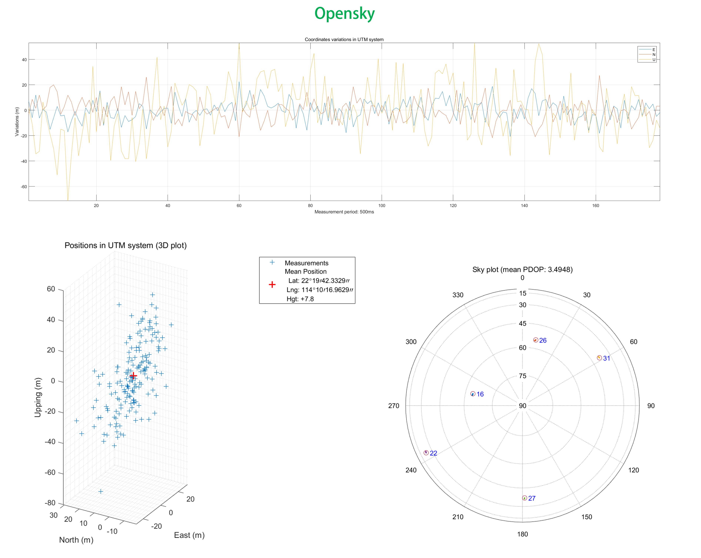

Position variations in East, North, and Up directions over the 160-second observation window fluctuate between approximately -50m and +40m, with most deviations contained within ±30m across all components. In this environment, the absence of reflective surfaces minimizes multipath interference, reducing phase estimation errors in tracking loops. The WLS methodology benefits from enhanced satellite signal strength, improved geometric configurations, and more predictable atmospheric delay patterns. The consistent signal-to-noise ratios across satellites produce well-balanced weighting factors, resulting in reasonable error distributions—typically within ±30m as evidenced in the visualization—which aligns with expected performance metrics for open-sky GNSS applications.

#### Urban Environment

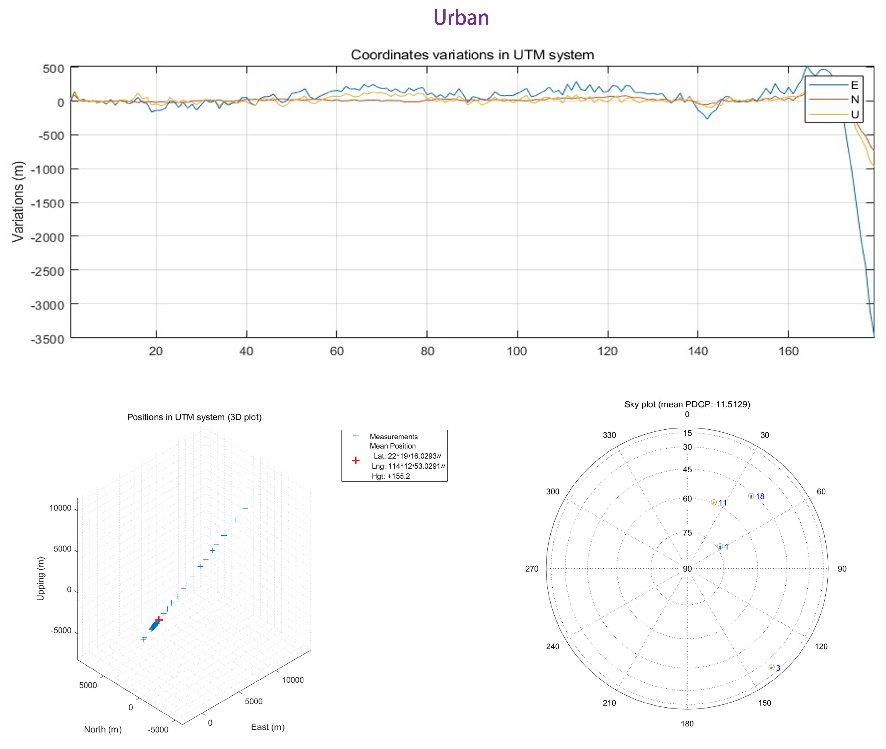

In contrast, the urban scenario demonstrates significantly degraded performance, with positioning errors reaching 100m within the initial 80 seconds before experiencing complete solution failure due to tracking lock loss. The traditional DLL and PLL implementations lack multipath suppression capabilities necessary for urban environments. Reflective surfaces prevalent in city settings introduce phase estimation errors that destabilize tracking loops, eventually causing lock loss after approximately 80 seconds of operation. Without specialized multipath mitigation techniques such as correlator-based methods or advanced filtering algorithms, both pseudorange and Doppler measurements deteriorate, increasing residual errors in the WLS computation and ultimately leading to solution divergence.

### Velocity Estimation Results

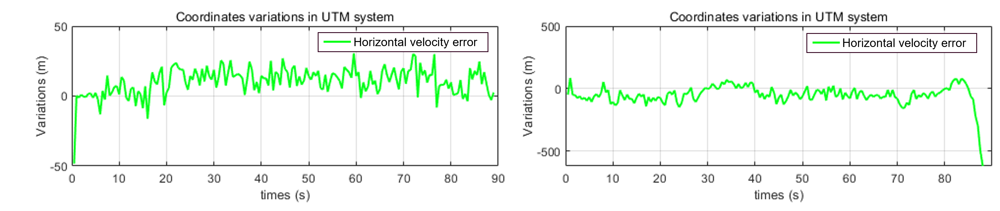

#### Open-Sky Environment
Horizontal velocity errors in open-sky conditions oscillate between -50 m/s and +50 m/s, indicating stable satellite visibility with minimal multipath effects, ensuring consistent WLS performance throughout the observation period. The relatively stable error pattern reflects good geometric conditions and signal quality.

#### Urban Environment
The urban scenario exhibits substantially larger velocity errors ranging from -500 m/s to +500 m/s, with significant deterioration occurring after 70 seconds. This performance degradation stems from obstructed satellite signals, multipath interference, and reduced satellite visibility in urban canyons. The WLS weighting scheme, typically based on elevation angles, encounters difficulties in urban settings where low-elevation satellites predominate, amplifying error magnitudes. Additionally, signal reflections introduce biases into Doppler measurements, further compromising velocity estimation accuracy compared to the superior geometry and signal quality available in open-sky conditions.

# Task 5 – Navigation Enhancement via Extended Kalman Filtering

## Methodology Overview

In pursuit of superior localization precision, we implemented an Extended Kalman Filter (EKF) architecture that integrates both pseudorange and Doppler observations. This sophisticated filtering mechanism offers temporal state estimation and measurement integration capabilities, significantly enhancing resilience against observation errors and environmental interference patterns. By employing dynamic statistical modeling, the EKF methodology delivers more refined coordinate solutions while demonstrating clear performance advantages compared to traditional WLS computation methods, particularly in signal-challenged operational contexts.

## Comparative Performance Analysis

The EKF implementation was evaluated across contrasting environmental scenarios, with visualized results presented below:

### Open-Sky Performance Assessment

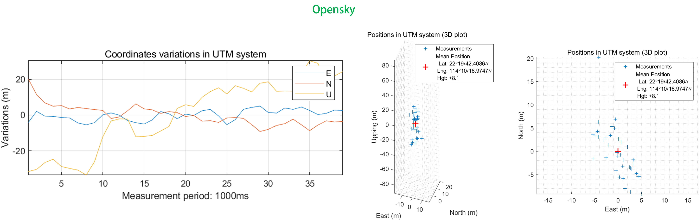

In unobstructed sky conditions, the filtering algorithm demonstrates excellent stability, with positional variations constrained primarily within ±20 meters across all coordinate dimensions. The 2D and 3D visualization plots reflect tightly clustered measurement distributions around the mean position, indicating effective noise suppression and estimation consistency throughout the observation period.

### Urban Canyon Performance Assessment

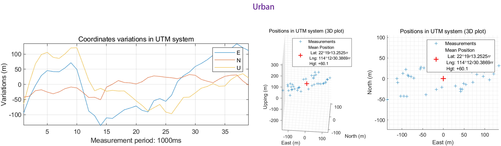

Under challenging urban conditions, the EKF continues to maintain operational functionality despite significant environmental interference. While coordinate variations show increased magnitudes (approximately ±100 meters), the system successfully preserves position estimation integrity throughout the measurement campaign. The spatial distribution plots reveal wider measurement scatter, yet the mean position calculation remains relatively stable – a substantial improvement over the WLS approach which experienced complete solution divergence in equivalent conditions.

The visualization confirms that Kalman filtering techniques provide essential robustness improvements in satellite navigation applications, particularly within signal-degraded urban environments where traditional positioning methods exhibit significant limitations.
