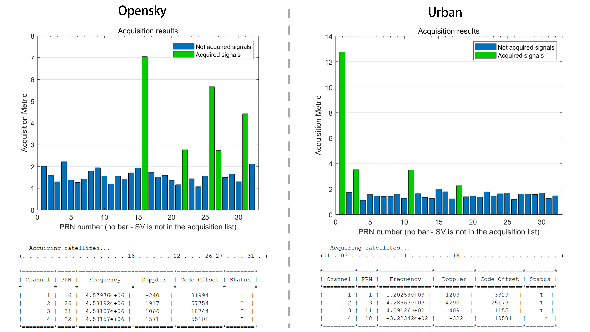
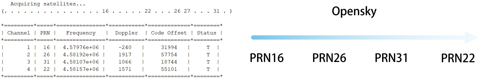

# AAE6102-Assignment1
POLYU 2025 S2 AAE6102-Assignment1

# GNSS Signal Acquisition and Processing

## Task 1 — Signal Acquisition

### Objective
Process the IF data using a GNSS SDR and generate the initial acquisition results.

### GNSS Signal Acquisition Process
The GPS signal acquisition process is structured into three distinct phases: initialization, initial acquisition, and precision refinement.

#### Phase 1: Initialization
The initialization phase involves setting up the necessary parameters for signal processing. This includes determining the number of samples for a complete C/A code period, calculating the sampling interval, extracting short segments from the raw signal for initial acquisition, preparing a longer DC-removed signal segment for refinement, generating a pre-computed lookup table of satellite C/A codes, defining the frequency search range (typically in 500Hz increments), and initializing arrays to store results. These preparations establish the foundation for subsequent signal processing.

#### Phase 2: Initial Acquisition (Coarse Search)
The initial acquisition phase aims to obtain preliminary estimates of code phase and carrier frequency for each satellite's PRN code. The process involves performing FFT on each potential PRN code to obtain its frequency domain representation, then testing each frequency bin within the defined range. For each bin, a local carrier signal is generated and removed to obtain in-phase and quadrature components, which are then transformed via FFT and used for spectral domain cross-correlation. Finally, correlation peaks are identified along with corresponding code phases and frequencies. If the peak-to-average ratio exceeds a threshold, the signal is considered potentially acquired.

#### Phase 3: Precision Refinement (Fine Acquisition)
The precision refinement phase refines the frequency estimates obtained during initial acquisition. First, a longer C/A code sequence is generated using the coarse code phase estimate from the previous phase. Code modulation is removed by correlation to isolate the carrier component. Then, a high-resolution FFT (at least 8 times longer than the code sequence) is applied, precise frequency bins are calculated, and the carrier frequency is refined by locating the peak magnitude in the high-resolution spectrum. The coarse code phase from the initial search is retained as the final code phase estimate.

### Methods for Reliability and Robustness
To ensure result reliability, two main methods are employed: first, two adjacent 1-millisecond segments are selected from the received signal for simultaneous processing, with the maximum correlation coefficient taken; second, beyond identifying the maximum correlation peak, the second-largest peak is also searched for, and if the ratio between them exceeds 1.5 and they are not too close, the satellite signal is considered successfully acquired.

### Results
The test results show successful acquisition of satellites 1, 3, 11, and 18 in the urban dataset, while satellites 16, 22, 26, 27, and 31 were acquired in the open sky dataset.

# Task 2 — Tracking Implementation

## Objective
Modify the tracking loop (DLL) to generate correlation plots and analyze tracking performance, examining urban interference effects on correlation peaks. (Multiple correlators must be implemented for plotting the correlation function)

## Tracking Process and Components

### Step 1: Tracking Fundamentals
Utilizing initial frequency and phase information from acquisition, the signal undergoes downconversion to compute multi-branch correlation values (Early, Prompt, Late) for I/Q component extraction. FFT techniques enhance computational efficiency through the following approach:

For phase processing, inverse FFT methodology is applied: IP + jQP = FFT^(-1)(FFT(signal) · conj(PRNprompt))

The DLL discriminator determines code phase error through the calculation:
DLL Discriminator = √(I²E + Q²E - I²L + Q²L) / √(I²E + Q²E + I²L + Q²L)

### Step 2: Real-Time Adjustment Mechanism
DLL/PLL discriminator outputs undergo low-pass filtering (e.g., IIR: y[n] = αx[n] + (1-α)y[n-1]), with local carrier frequency and PRN code phase dynamically adjusted via NCO. The system updates at 1ms intervals (matching GPS C/A code cycles), storing results in the trackResults structure to maintain real-time synchronization with received signals.

### Step 3: Design Considerations
Loop bandwidth and damping ratio optimization balances noise suppression against dynamic response capabilities. The tracking loop outputs carrier frequency, code phase, and navigation bits, while multi-correlator plots facilitate performance analysis, particularly regarding urban environment interference effects on correlation peaks.

## Results Analysis

### Open-Sky Performance
* **PRN 16**: Filtered DLL maintains stability in the 6000-8000 range, with raw discriminator and filtered PLL showing fluctuation. Raw DLL amplitude contains noise, but filtered DLL stabilizes at 0.2-0.4, indicating effective noise reduction. Overall tracking remains stable.
* **PRN 26**: Filtered DLL correlation values stay steady in the 6000-8000 region, raw discriminator exhibits greater variation. Filtered PLL tracks closely with slight deviations. Raw DLL amplitude fluctuates (±0.5), filtered DLL stabilizes at 0.2-0.3, demonstrating good noise suppression.
* **PRN 31**: Filtered DLL correlation baseline appears lower at 4000-6000 compared to satellites 16 and 26. Raw discriminator and filtered PLL oscillate more significantly, raw DLL amplitude varies (±0.6), filtered DLL stabilizes at 0.1-0.3 with downward trends. Tracking appears less stable than previous satellites.
* **PRN 22**: Filtered DLL correlation maintains at 5000-7000, raw discriminator shows spikes. Filtered PLL tracks smoothly with some divergence. Raw DLL amplitude fluctuates (±0.5), filtered DLL stabilizes at 0.2-0.4 with dips. Tracking maintains moderate stability, with filtering effectively mitigating noise.
* **PRN 27**: Filtered DLL correlation holds at 4000-6000, similar to satellite 31. Raw discriminator and filtered PLL vary notably. Raw DLL amplitude fluctuates (±0.6), filtered DLL stabilizes at 0.1-0.3 with end instability. Tracking exhibits lowest stability, though filtering provides some improvement.

The SoftGNSS system performs well in open-sky environments, with satellites 16 and 26 displaying optimal stability and signal strength. In the open-sky environment, signal strength progressively decreases from PRN 16, PRN 26, PRN 31, PRN 22, to PRN 27, correlating with their tracking stability performance. Filtering mechanisms (PLL and DLL) effectively reduce noise and stabilize outputs. Satellites 31, 22, and 27 demonstrate weaker performance due to signal or environmental factors, but the system maintains lock overall.

### Urban Environment Performance
Tracking results for satellites 1, 3, 11, and 18 in the urban dataset illustrate a stable filtered DLL baseline, though correlation strength varies across PRNs. Raw PLL and DLL discriminators exhibit significant noise, while filtering stabilizes outputs to some extent. Inconsistent correlation and occasional signal instability occur, particularly toward tracking conclusion. In the urban environment, signal strength decreases in the order of PRN 3, PRN 18, PRN 1, and PRN 11, reflecting their varying visibility conditions in the urban canyon.

These phenomena result from urban multipath effects and signal obstructions, which weaken satellite signals and introduce noise. Lower correlation baselines (e.g., PRN 1 and 11) reflect signal attenuation from buildings, while higher values (e.g., PRN 3 and 18) indicate better visibility conditions. Intermittent signal loss arises from blockages and reflections during movement.

### Open-Sky versus Urban Comparison
Urban tracking underperforms compared to open-sky results, where satellites 16 and 26 maintained stable 6000-8000 correlations with minimal noise. Urban multipath and obstructions cause wider amplitude fluctuations and inconsistent correlations (5000-15000), reducing filtering effectiveness. Open-sky's clear line-of-sight contrasts with urban challenges, explaining the reliability gap. The fundamental difference lies in unobstructed signal propagation paths in open environments versus urban multipath and blockages disrupting signal integrity.

